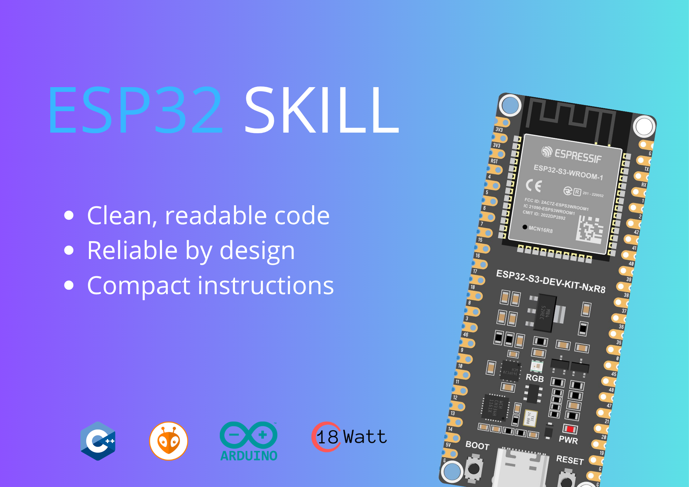

# Claude Skills for ESP32

A compact, state-of-the-art implementation of Claude AI capabilities for ESP32 microcontrollers.

## Features

- **Lightweight Integration**: Optimized for ESP32's constrained resources
- **API Integration**: Connect to Claude API with minimal overhead
- **Efficient Processing**: Low-latency inference and response handling
- **Memory Optimized**: Tailored for embedded systems

## License

GPL License
